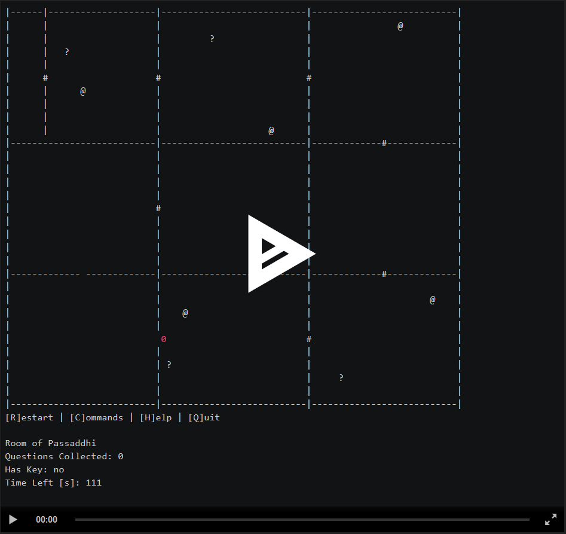

# Meaning of Life

## Overview
Welcome to the Meaning of Life Game where you turn questions into a key to unlock the 
meaning of life.  

## Directions
Walk through all the rooms to collect questions. Beware of the evil Answers, "@", that steal away questions.
The second to last room will unlock all rooms that
close behind you, except for the very last room.
To unlock the last room, you need to go back to the first
room with 6 questions ang get the key of life, "*".
Use the key to unlock the last room and find the meaning of
life.  Goodluck!

## Link to Assignment
[Meaning of Life](http://159.89.136.195:3000/a/YycHdFEdoswKm4USz6akxxhzA)

## Improvements
- Answer positions update realtime without turn-based movements
- Convert to Virtual Reality
